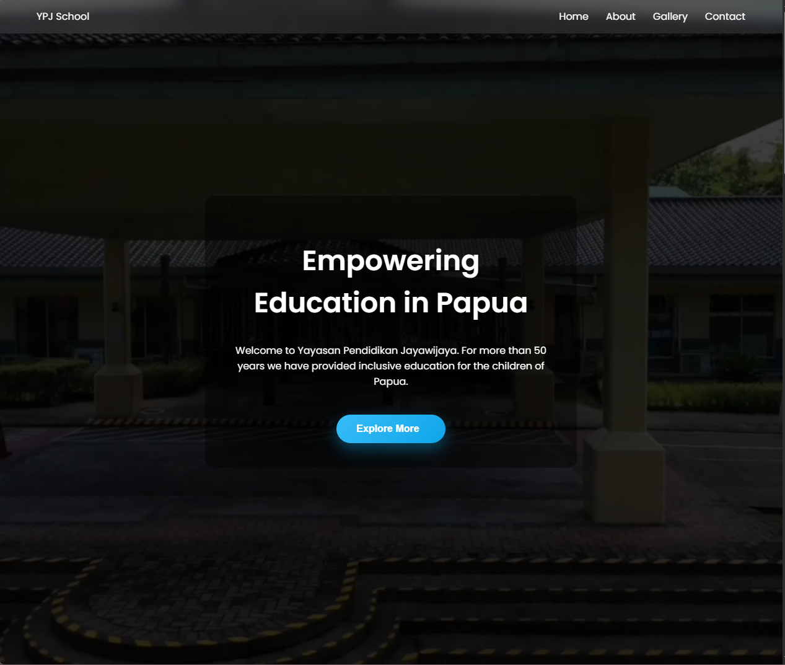

# 🏫 YPJ Website Profile

A modern **institution profile website** for **Yayasan Pendidikan Jayawijaya (YPJ)**.

This website is designed to present information about the foundation, its educational mission, programs, and activities through a clean and professional interface.

---

## 🌐 Live Website

Visit the live website here:

👉 https://agusadhitama.github.io/ypj-website-profil/

---

## 📖 About YPJ

**Yayasan Pendidikan Jayawijaya (YPJ)** is an educational foundation dedicated to supporting and developing quality education.

This website serves as a digital platform where visitors can explore information about the foundation, including its profile, activities, and documentation.

---

## 🚀 Features

* 🏠 **Home** – Main landing page of the website  
* ℹ️ **About** – Information about the foundation  
* 🖼 **Gallery** – Documentation of activities and events  
* 📬 **Contact** – Contact information section  
* 📱 **Responsive design** for various devices  
* 🌐 **Deployed using GitHub Pages**

---

## 🧠 Tech Stack

This project was built using:

* **HTML5**
* **CSS3**
* **JavaScript**

Deployment:

* **GitHub Pages**

---

## 📸 Preview

---

## 🎯 Purpose of the Project

This project was created to demonstrate:

* Institutional website development
* Responsive frontend layout
* Simple and clean UI for organization profile websites

---

## 👨‍💻 Author

**Agus Satria Adhitama**

Bachelor of Computer Science (S.Kom)  
Web Development • IT Support • System & Network Enthusiast

GitHub  
https://github.com/agusadhitama

---

⭐ If you find this project useful, feel free to give it a star!
